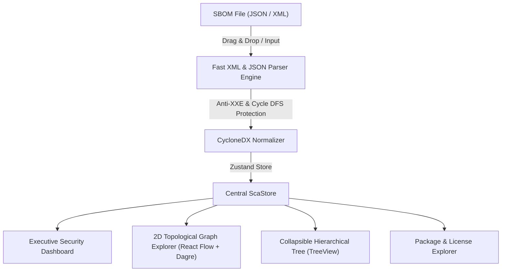

<div align="right">

[🇺🇸 English](README.md) &nbsp;|&nbsp; [🇧🇷 Português](README.pt-BR.md)

</div>

# 🛡️ CycloneDX SCA Visualizer & Dependency Tree Platform

[](https://github.com/brunoez/sca)
[](https://github.com/brunoez/sca/pkgs/container/sca)

-cyan.svg)


> **Executive Intelligence & Software Supply Chain Graph Visualizer (CycloneDX JSON & XML)**  
> 100% Client-Side Single-Page Application (SPA) for visual Software Bill of Materials (SBOM) analysis, interactive SCA Health Rating calculation, license compliance matrix, hierarchical tree, and 2D dependency graph with ancestral impact path tracing.
>
> 🌐 **Live Demo:** [https://sca.brunoizidorio.com.br](https://sca.brunoizidorio.com.br)

---

## 📸 Interface Preview

<div align="center">
  
  <p><em>Executive Security Dashboard: Real-time SCA Health Rating, vulnerability metrics, and embedded 2D topological graph.</em></p>
</div>

<br/>

| 🌐 2D Topological Dependency Graph | 🌳 Collapsible Hierarchical TreeView |
| :---: | :---: |
|  |  |
| *Dagre LR auto-layout with reactive MiniMap* | *Multi-level nested supply chain depth exploration* |

| 📊 Compliance Matrix & Remediation ROI | 📦 Package & Vulnerability Explorer |
| :---: | :---: |
|  |  |
| *Legal license distribution & high-ROI quick wins* | *Instant search, type filters, and CVE badges* |

<details>
  <summary>🔍 <strong>View More Screenshots (Landing Page & Ancestral Impact Modal)</strong></summary>
  <br/>

  ### Executive Landing Page (Privacy-First)
  <div align="center">
    
    <p><em>Landing page with drag-and-drop ingestion and instant sample loaders.</em></p>
  </div>

  ### Ancestral Impact Path & Remediation Modal
  <div align="center">
    
    <p><em>Ancestral root-to-leaf inclusion path tracing and remediation recommendation.</em></p>
  </div>
</details>

---

## 🏗️ Architecture & Data Flow (Privacy-First)

All file ingestion, schema validation, cycle detection, and graph rendering execute exclusively within local browser RAM. No data or SBOM content is ever transmitted to cloud servers or external backends.



---

## 🌟 Key Features

- **100% Client-Side & Privacy-First**: Zero server-side persistence. Your SBOMs and dependency metadata remain secure inside your local browser sandbox.
- **Executive Landing Page**: Feature-rich landing page with security guarantees, capabilities overview, 3-step guide, and interactive FAQ.
- **Executive Security Dashboard**:
  - **SCA Security Rating (0–100 & Grades A+ to F)**: Direct 1-to-1 calculation with transparent penalty formula displayed via hover popover.
  - **3-Tier Risk Classification**: 🟢 **Low Risk** (>=85), 🟡 **Moderate Risk** (70–84), and 🔴 **High Risk** (<70).
  - **Recharts Data Visualizations**: Vulnerability severity distribution, legal license matrix, and supply chain tree depth breakdown.
  - **Remediation Quick Wins**: Security ROI algorithm prioritizing direct packages that eliminate the highest number of downstream vulnerable transitive dependencies.
- **Integrated 2D Topological Graph Navigator**:
  - Embedded directly within the **Executive Dashboard** and available in the dedicated **"2D Dependency Graph"** tab.
  - Automated hierarchical Left-to-Right (LR) layout powered by Dagre and React Flow (`@xyflow/react`).
  - Interactive **Impact Path (Ancestors) Highlighting** upon node selection.
  - Dark mode controls and reactive **MiniMap** with level-coded badges.
- **Collapsible Hierarchical Tree (TreeView)**: Deep exploration across nested dependency levels with visual depth cues.
- **Package & License Explorer**: Searchable interactive table with instant filtering, sorting, and XSS-sanitized modal details via DOMPurify.
- **Anti-XXE & Anti-DoS Safeguards**: XML parser with external DTD entities disabled (`processEntities: false`), 50MB payload limits, and DFS cycle guard (`maxDepth = 32`).
- **Real-Time Internationalization (i18n)**: Instant switching between English (US) and Portuguese (PT-BR).

---

## 📐 Scoring Formula (SCA Health Rating & Calculation Breakdown)

$$\text{CVE Penalty} = 15 \times \text{Crit} + 6 \times \text{High} + 2 \times \text{Med} + 0.5 \times \text{Low}$$

$$\text{License Penalty} = 5 \times \text{Copyleft (max 30)} + 0.05 \times \text{Unknown (max 5)}$$

$$\text{Final Score} = \max\left(0, 100 - (\text{CVE Penalty} + \text{License Penalty})\right)$$

| Score | Conceptual Grade | Risk Tier | Badge Color |
| :---: | :---: | :---: | :---: |
| 95 – 100 | **A+** | Low Risk | 🟢 Emerald Green |
| 85 – 94 | **A** | Low Risk | 🟢 Emerald Green |
| 75 – 84 | **B+** | Moderate Risk | 🟡 Amber / Cyan |
| 65 – 74 | **B** | Moderate Risk | 🟡 Amber / Cyan |
| 50 – 64 | **C** | High Risk | 🔴 Rose Red |
| 35 – 49 | **D** | High Risk | 🔴 Rose Red |
| 0 – 34 | **F** | Critical Risk | 🔴 Rose Red |

---

## 🚀 Running with Docker (Ready to Use)

### 1. Quick Run via GHCR (GitHub Container Registry)
Run the official pre-built image directly from GitHub Container Registry:
```bash
docker run -d -p 8080:8080 --name sca-visualizer ghcr.io/brunoez/sca:latest
```
Open in your browser: **`http://localhost:8080`**

### 2. Launch with Docker Compose:
```bash
docker-compose up -d --build
```
Open in your browser: **`http://localhost:8081`**

### 3. Build the Image Manually:
```bash
cd frontend
docker build -t ghcr.io/brunoez/sca:latest .
docker run -d -p 8080:80 --name sca-visualizer ghcr.io/brunoez/sca:latest
```

---

## 🛠️ Local Development

### Prerequisites
- **Node.js**: `>= 24.x LTS`
- **npm**: `>= 10.x`

### Setup Steps:
```bash
# Navigate to the frontend directory
cd frontend

# Install dependencies
npm install

# Start Vite development server
npm run dev

# Run full Vitest test suite
npm run test -- --run

# Build production static bundle
npm run build
```

---

## 🧪 Test Suite

The application is thoroughly verified using **Vitest** and **React Testing Library** with end-to-end integration and unit tests:

```bash
cd frontend
npm run test -- --run
```
- **17 test files**
- **86 unit and integration tests** (100% passing)

---

## 📜 Version History & Changelog

See [`CHANGELOG.md`](./CHANGELOG.md) for detailed version history and release notes.

---

## 📄 License

Distributed under the **MIT** License. See [`LICENSE`](./LICENSE) for details.
