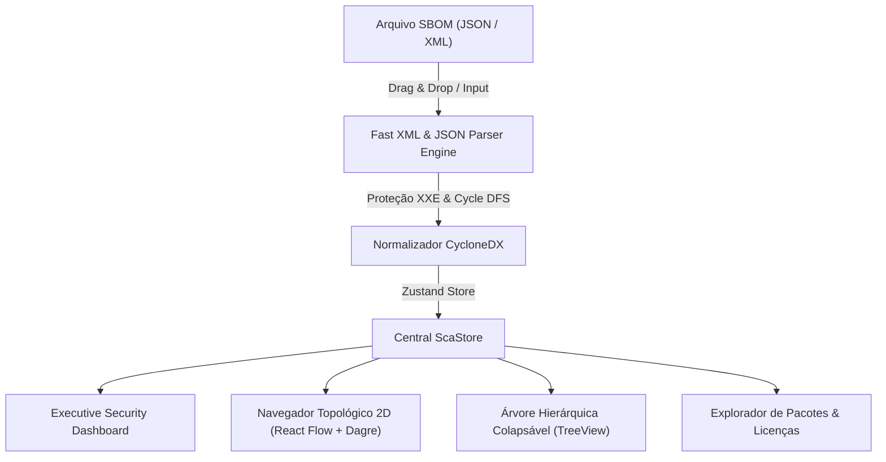

# 🛡️ CycloneDX SCA Visualizer & Dependency Tree Platform


-cyan.svg)


> **Inteligência Executiva & Visualizador de Grafo de Supply Chain de Software (CycloneDX JSON & XML)**  
> Aplicação Web Single-Page (SPA) 100% Client-Side para análise visual de Software Bill of Materials (SBOM), cálculo de SCA Health Rating com memória de cálculo interativa, matriz de licenças, árvore hierárquica e grafo 2D de dependências com rastreamento de caminho de impacto ancestral.

---

## 🏗️ Arquitetura & Fluxo de Dados (Privacy-First)

Toda a ingestão, validação de schemas, detecção de ciclos e renderização do grafo ocorrem exclusivamente em memória local RAM do navegador do usuário. Nenhum dado é enviado para a nuvem ou servidores externos.



---

## 🌟 Principais Recursos

- **100% Client-Side & Privacy-First**: Zero persistência em servidor. Seus SBOMs e fontes de código permanecem protegidos no ambiente do cliente.
- **Landing Page com Paridade Executiva**: Página inicial rica com seções de Garantias de Segurança, Recursos, Guia em 3 Passos e FAQ interativo.
- **Dashboard Executivo de Segurança**:
  - **SCA Security Rating (0–100 & Notas A+ a F)**: Cálculo 1-para-1 direto e transparente com memória de cálculo exibida em popover ao passar o mouse.
  - **Classificação Transparente em 3 Níveis**: 🟢 **Baixo Risco** (>=85), 🟡 **Risco Moderado** (70–84) e 🔴 **Risco Elevado** (<70).
  - **Gráficos Recharts**: Distribuição de vulnerabilidades, matriz de licenças jurídicas e análise de profundidade da árvore.
  - **Quick Wins de Remediação**: Algoritmo de ROI que prioriza dependências diretas que arrastam o maior número de sub-dependências transitivas vulneráveis.
- **Navegador Topológico 2D Integrado**:
  - Integrado diretamente no **Dashboard Executivo** e presente na aba dedicada **"Grafo 2D de Dependências"**.
  - Layout automatizado hierárquico (LR) com Dagre e React Flow (`@xyflow/react`).
  - Destaque do **Caminho de Impacto** (ancestrais) ao selecionar qualquer nó no grafo.
  - Controles escuros e **MiniMapa** funcional com código de cores por nível.
- **Árvore Hierárquica Colapsável (TreeView)**: Navegação profunda em dependências aninhadas com indicação visual de profundidade.
- **Explorador de Pacotes**: Tabela interativa com busca instantânea, ordenação e modal de detalhes sanitizado contra XSS via DOMPurify.
- **Proteção Anti-XXE & DoS**: Parser XML com DTDs externas estritamente desabilitadas e limite de recursão DFS (`maxDepth = 32`).
- **Internacionalização (i18n)**: Suporte bilíngue em tempo real (Português PT-BR e Inglês EN-US).

---

## 📐 Fórmula de Pontuação (SCA Health Rating & Memória de Cálculo)

$$\text{Penalidade CVE} = 15 \times \text{Crit} + 6 \times \text{High} + 2 \times \text{Med} + 0.5 \times \text{Low}$$

$$\text{Penalidade Licenças} = 5 \times \text{Copyleft (máx 30)} + 0.05 \times \text{Desconhecida (máx 5)}$$

$$\text{Score Final} = \max\left(0, 100 - (\text{Penalidade CVE} + \text{Penalidade Licenças})\right)$$

| Score | Nota Conceitual | Nível de Risco | Cor |
| :---: | :---: | :---: | :---: |
| 95 – 100 | **A+** | Baixo Risco | 🟢 Verde Emerald |
| 85 – 94 | **A** | Baixo Risco | 🟢 Verde Emerald |
| 75 – 84 | **B+** | Risco Moderado | 🟡 Amarelo Amber / Cyan |
| 65 – 74 | **B** | Risco Moderado | 🟡 Amarelo Amber / Cyan |
| 50 – 64 | **C** | Risco Elevado | 🔴 Vermelho Rose |
| 35 – 49 | **D** | Risco Elevado | 🔴 Vermelho Rose |
| 0 – 34 | **F** | Risco Crítico | 🔴 Vermelho Rose |

---

## 🚀 Executando com Docker (Produção)

O projeto inclui um container de produção multi-stage baseado em **Node.js 24 LTS** e **Nginx slim** com cabeçalhos de segurança HTTP pré-configurados:

### 1. Iniciar via Docker Compose:
```bash
docker-compose up -d --build
```
Acesse em seu navegador: **`http://localhost:8081`**

### 2. Build da Imagem Manualmente:
```bash
cd frontend
docker build -t cyclonedx-sca-visualizer:latest .
docker run -d -p 8081:80 --name sca_prod cyclonedx-sca-visualizer:latest
```

---

## 🛠️ Desenvolvimento Local

### Pré-requisitos
- **Node.js**: `>= 24.x LTS`
- **npm**: `>= 10.x`

### Passos para Rodar:
```bash
# Acesse o diretório do frontend
cd frontend

# Instale as dependências
npm install

# Inicie o servidor de desenvolvimento Vite
npm run dev

# Execute a suíte de testes (Vitest)
npm run test -- --run

# Build de Produção
npm run build
```

---

## 🧪 Suíte de Testes

A aplicação utiliza **Vitest** e **React Testing Library** com cobertura total de unit e integration tests:

```bash
cd frontend
npm run test -- --run
```
- **13 arquivos de teste**
- **69 testes unitários e de integração E2E** (100% aprovados)

---

## 📜 Historico de Versões & Changelog

Consulte o arquivo [`CHANGELOG.md`](./CHANGELOG.md) para visualizar o histórico de atualizações de cada versão.

---

## 📄 Licença

Distribuído sob a licença **MIT**. Veja `LICENSE` para mais detalhes.
