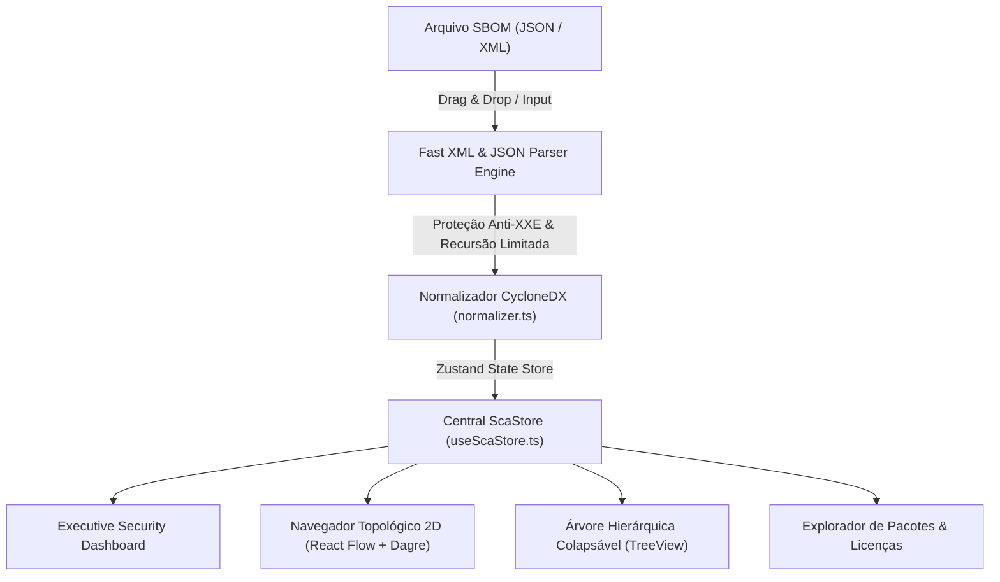

# 🏗️ Arquitetura & Fluxo de Dados (Privacy-First)

## 📌 Visão Geral da Arquitetura

O **CycloneDX SCA Visualizer** adota uma arquitetura estritamente **100% Client-Side Single Page Application (SPA)** desenvolvida em **React 18**, **TypeScript**, **Vite**, **TailwindCSS** e **Zustand**.

Não há nenhum backend executando parsing, banco de dados ou serviço em nuvem. Toda a ingestão, sanitização, resolução de dependências, detecção de ciclos e renderização de grafos acontecem localmente na memória RAM do navegador.

---

## 🛡️ Medidas de Segurança no Parsing

1. **Proteção Anti-XXE (XML External Entity)**:
   - O parser XML (`fast-xml-parser`) está configurado com `processEntities: false`, `ignoreAttributes: false` e DTDs externas estritamente desabilitadas.
2. **Proteção contra Recursão Infinita & Ciclos**:
   - A travessia de dependências (DFS) utiliza um conjunto `visited` e limita a profundidade máxima em `maxDepth = 32`.
3. **Sanitização XSS (DOMPurify)**:
   - Toda renderização de descrições ou metadados de pacotes passa por sanitização rigorosa via `DOMPurify.sanitize()`.
